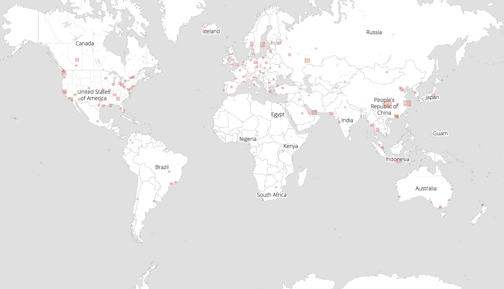
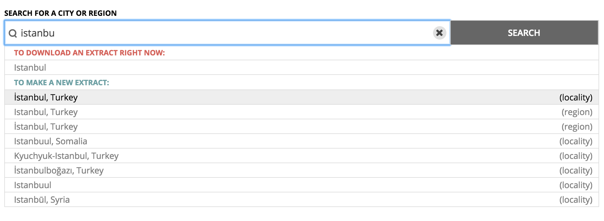
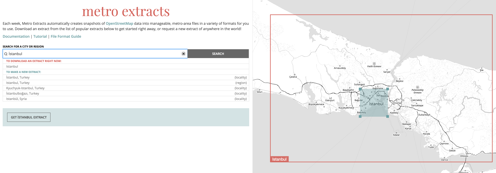
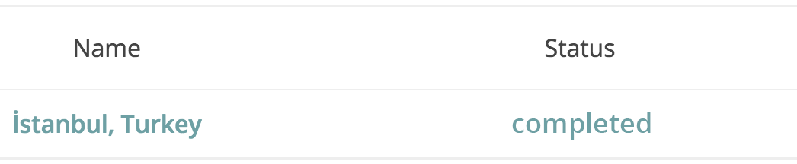
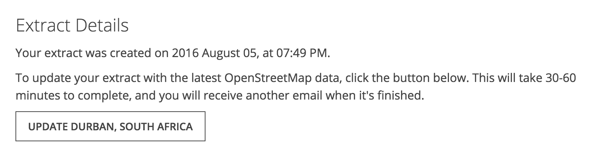

# Create a custom Metro Extract

Is the location you're looking for not on the extract list? Mapzen hosts the top 200 of the world's most popular metro areas available for immediate download, but also allows for the creation of custom extracts.

## Custom extract walkthrough

1. Go to the Metro Extracts download page at https://mapzen.com/data/metro-extracts/
2. Type the location for where you want a custom extract. The geographic hierarchy of the feature displays in the drop-down menu, allowing you to make a more precise extract.

    

3. Once you have selected a place from the drop-down menu, a solid blue bounding box appears on the map. You can drag this to specify the boundaries of the extract. If you request a custom extract near a popular extract, there is a red line outlining the popular extract.

    

4. After you have the custom extract ready, click Get Extract. You need to sign in to your Mapzen account, or create one if you are a new user. See the [Mapzen developer overview](https://mapzen.com/documentation/overview/) for more information on accounts.

Custom extracts can take about 30-60 minutes to generate, depending on the size. An email will be sent to the address associated with your Mapzen account, but will also be viewable on the Metro Extracts page under 'your custom extracts'. This page also shows you the status of the custom extract and allows you to access previous requests as well.

### Share custom extracts

After your custom extracts have been created, they are viewable on the 'your custom extracts' page. Individual extracts can be shared with anyone who also has a Mapzen account by opening the individual extract and then copying the URL and sending it to the other person.

### Update custom extracts

The data used in a custom extract is pulled from OpenStreetMap at the time of your request. While the popular Metro Extracts available for immediate download are updated on a weekly basis, custom extracts are not. To update the data in your custom extract, you can click Update on the custom extracts page. 

