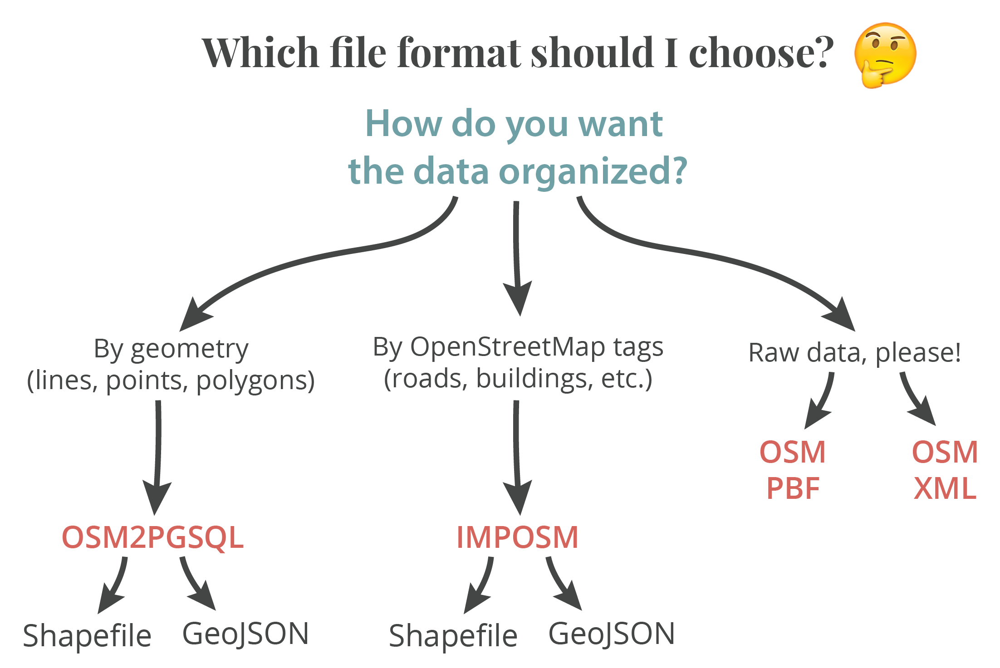

#Choose a file format in Metro Extracts

Once you select a Metro Extract from https://mapzen.com/data/metro-extracts/, there are several different types of spatial data file formats to choose from. The picture below shows the variety of options available for every Metro Extract. These range from raw, unformatted data that's awesome for data processing to data that's organized to make sense for use in software applications or for web mapping.

##### Not sure what to pick?
Here's a simple diagram that explains the variety of file formats:

Metro Extracts offers spatial file formats in a spectrum of raw data to more processed. Here’s a quick explanation on the data types: The less-processed formats, such as xml and pbf, are intended for developers who are running their own tools on the data. For most map-making workflows, a shapefile or GeoJSON works well because these can be added directly to many software applications. If you’re working on adding this data to a web map, a GeoJSON is preferred. All extracted shapefiles and GeoJSONs use EPSG:4326 for the projection.

### Data split by geometry

The **OSM2PGSQL** file format separates the OpenStreetMap data from the Metro Extract into three files: **lines, points,** and **polygons**. This makes showing features with a particular geometry simple, but each feature will include all of the various OSM tags. For example, this is the GeoJSON for a point from this data format:

	{
    "type": "Feature",
    "properties": {
        "osm_id": 368395980,
        "access": null,
        "aerialway": null,
        "aeroway": "helipad",
        "amenity": null,
        "area": null,
        "barrier": null,
        "bicycle": null,
        "brand": null,
        "bridge": null,
        "boundary": null,
        "building": null,
        "capital": null,
        "covered": null,
        "culvert": null,
        "cutting": null,
        "disused": null,
        "ele": "33",
        "embankment": null,
        "foot": null,
        "harbour": null,
        "highway": null,
        "historic": null,
        "horse": null,
        "junction": null,
        "landuse": null,
        "layer": null,
        "leisure": null,
        "lock": null,
        "man_made": null,
        "military": null,
        "motorcar": null,
        "name": "Unisys Heliport",
        "natural": null,
        "oneway": null,
        "operator": null,
        "poi": null,
        "population": null,
        "power": null,
        "place": null,
        "railway": null,
        "ref": null,
        "religion": null,
        "route": null,
        "service": null,
        "shop": null,
        "sport": null,
        "surface": null,
        "toll": null,
        "tourism": null,
        "tower:type": null,
        "tunnel": null,
        "water": null,
        "waterway": null,
        "wetland": null,
        "width": null,
        "wood": null,
        "z_order": null
    },
    "geometry": {
        "type": "Point",
        "coordinates": [
            -74.50099,
            40.3709408
        ]
    }
    }

That's a lot of information to explain that this is a helipad. Every OSM tag that could be applied to a point, line, or polygon is stored as a feature property within that point, line, or polygon. This file format is great if you want some refinement of the OSM data, but still want to see all possible tags for every feature.

### Data split by OSM tags

The **IMPOSM** file format is the most refined file format offered in Metro Extracts. This format generates multiple files, separated by OSM tag and sorted into logical types such as:
- Administrative boundaries
- Aeroways
- Amenities
- Buildings
- Land Usage
- Places
- Roads
- Transport Areas
- Water Areas
- Waterways

The naming for these layers comes straight from OpenStreetMap and might be confusing if you're not used to OSM tags. Here's more information about how tags work: [http://wiki.openstreetmap.org/wiki/Map_Features](http://wiki.openstreetmap.org/wiki/Map_Features).

This file format follows the [IMPOSM specifications](https://imposm.org/docs/imposm/latest/database_schema.html#tables), but differs a little. For instance, roads are simplified to include motorways and railways. If the filename has the suffix gen, it’s been generalized.

### Raw OSM Data

The raw, unformatted data in Metro Extracts from OpenStreetMap is stored in two formats: [**PBF**](http://wiki.openstreetmap.org/wiki/PBF_Format) and [**XML**](http://wiki.openstreetmap.org/wiki/OSM_XML). This data is intended for use in a database (SQL for instance) as it includes *everything* from the extract and is not simplified at all. If you want to make custom groupings of the data through your own processing, this is the type for you! There are two options for this raw data format- PBF or XML. There are more specific reasons to use one over another, but PBF is a more compressed version, allowing for faster downloads.

### Coastlines

Metro Extracts generates coastlines of each area, available in a shapefile format. These land and water areas lack OpenStreetMap attribute data, making them small in file size and useful if you need an area polygon for a software application. Downloading coastline data in OpenStreetMap can be [challenging](http://openstreetmapdata.com/processing/coastline), but Metro Extracts joins the coastlines together an makes it simple to use.
