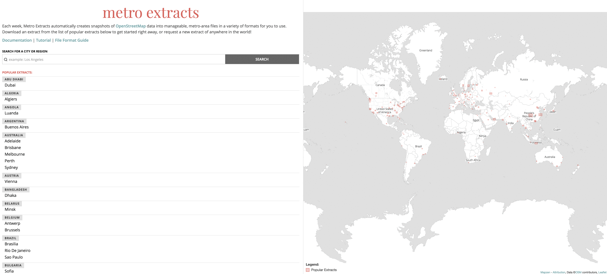

Metro Extracts are chunks of [OpenStreetMap](http://www.openstreetmap.org/) data clipped to the rectangular region surrounding a particular city or region of interest. Data is available for locations around the world.

To download the OSM data, go to the Metro Extracts download page at https://mapzen.com/data/metro-extracts/. The page has a web map and list of popular places that available for immediate download. You can also use the search bar to look for areas that may require a custom extract to be made, which can take up to 30-60 minutes to be created and require a [GitHub](https://github.com) developer account.

To learn more about using Metro Extracts, you can follow this [tutorial](walkthrough.md). You will download the extracted OSM data for a region and load the file into QGIS, which is a free, open-source desktop GIS application.
