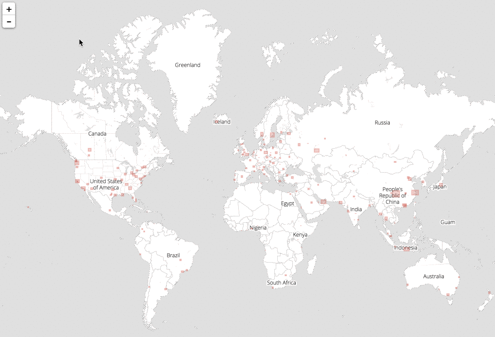

Metro Extracts are chunks of [OpenStreetMap](http://www.openstreetmap.org/) data clipped to the rectangular region surrounding a particular city or region of interest. Data is available for locations around the world.

To download the OSM data, go to the Metro Extracts download page at https://mapzen.com/data/metro-extracts/. The page has a web map and list of popular places that available for immediate download. You can also use the search bar to look for areas that may require a custom extract to be made, which can take up to 30-60 minutes to be created and require a [GitHub](https://github.com) developer account.

When you download from Metro Extracts, you can choose from several spatial data formats that run a spectrum of raw to more processed. For most map-making workflows, a shapefile or GeoJSON works well because these can be added directly to many software applications. The less-processed formats, such as xml and osm, are intended for developers who are running their own tools on the data. For more information on the various file formats included in Metro Extracts, learn more [here](fileformat.md).

Metro Extracts is updated weekly, typically on weekends, but the last modified date and time is listed on the website. Custom extracts are created from the latest version OpenStreetMap has available. 

To learn more about using Metro Extracts, you can follow this [tutorial](walkthrough.md). You will download the extracted OSM data for a region and load the file into QGIS, which is a free, open-source desktop GIS application.

If you want OpenStreetMap data for a city that is not currently available from Metro Extracts, you can follow the [instructions for contributing](https://github.com/mapzen/metroextractor-cities#contributing), or [open an issue](https://github.com/mapzen/metroextractor-cities/issues) requesting that your city be added to list.
