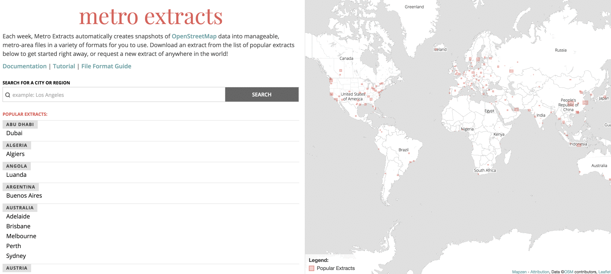

# Download OpenStreetMap data with Metro Extracts

Metro Extracts are chunks of [OpenStreetMap](https://www.openstreetmap.org) data clipped to a rectangular region surrounding a particular city or region of interest. Data is available for locations around the world.

To download the OSM data, go to the Metro Extracts download page at https://mapzen.com/data/metro-extracts/ and either choose a popular city extract or request a custom extract using the search bar.

## Background of the project

The initial version of an [Metro Extracts](http://metro.teczno.com/) was created in 2011 by [Michal  Migurski](https://twitter.com/michalmigurski), responding to a basic problem: if you wanted to use OSM data to make a map of just the New York City metro area, you could either do a total [OSM Planet](http://wiki.openstreetmap.org/wiki/Planet.osm) download or download individual states from [Geofabrik](http://download.geofabrik.de/) and then have to clip all the data to the size of the metro area.

Thus the original Metro Extracts, which provided downloads of metro areas, was created. And [Nelson Minar](http://somebits.com/) and [Smart Chicago](http://www.smartchicagocollaborative.org/) and others in the mapping community contributed to it and helped maintain it. With [Extractotron](https://github.com/migurski/Extractotron/), if you wanted to get OSM data of just the New York City metro area, you could do so really easily.

Eventually Mapzen took on running and releasing Metro Extracts. There is a [chef recipe](https://github.com/mapzen/chef-metroextractor) to do it (if you think about food and not code, [learn more about Chef here](https://docs.getchef.com/essentials_cookbook_recipes.html)), which makes maintenance and updating the extracts easier.

## Custom Extracts

Is the location you're looking for not on the extract list? Mapzen hosts the top 200 of the world's most popular metro areas available for immediate download, but also allows for the creation of custom extracts.

#### Create a custom Extract
1. Type in the location you want a custom extract for. You'll see the geographic granularity of the feature in the dropdown menu, allowing you to make a more precise extract.
2. Once you've selected a place from the dropdown menu, a solid blue bounding box will appear on the map. You can drag this to specify the boundaries of the extract. You'll see in the example below, that if you request a custom extract near a popular extract, you'll see a red line outlining the popular extract.

3. After you have the custom extract ready, press the 'Get Extract' button.
4. You'll be prompted to either sign up or sign in with a Mapzen Developer account. This uses [GitHub](https://www.github.com) authentication (if you don't have a GitHub account, you can sign up for one at: [https://github.com/join](https://github.com/join))
5. Custom extracts can take about 30-60 minutes to generate, depending on the size. An email will be sent to the address associated with your GitHub account, but will also be viewable on the Metro Extracts page under 'your custom extracts'. 

## Do more with Metro Extracts

If you want to learn more about the Metro Extracts formats and what you can do with the data, follow this [tutorial](walkthrough.md). In the lesson, you will review the available file formats, load the Metro Extracts data into QGIS, perform attribute queries, and change the symbols used to draw the features.
