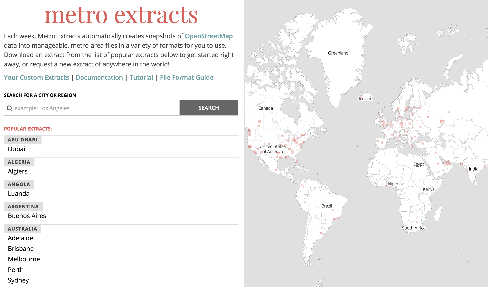
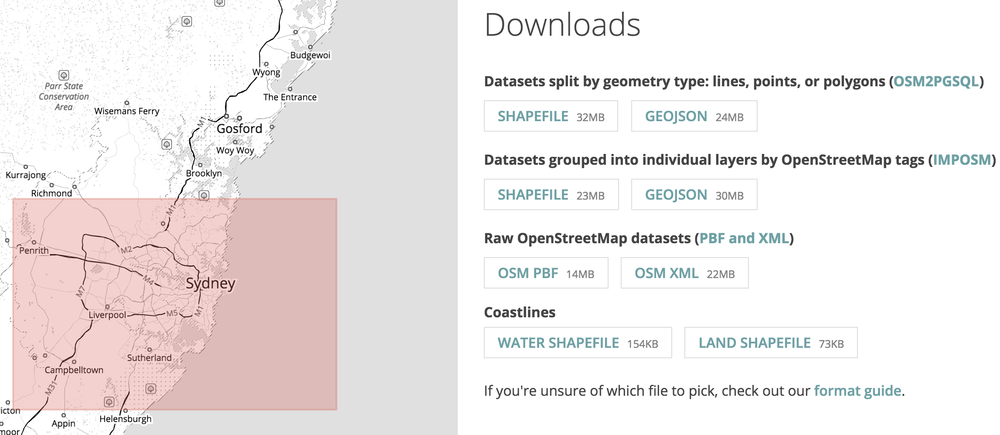
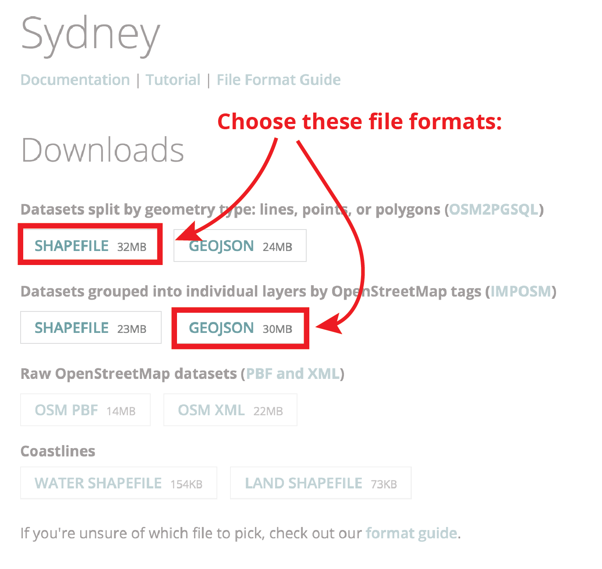
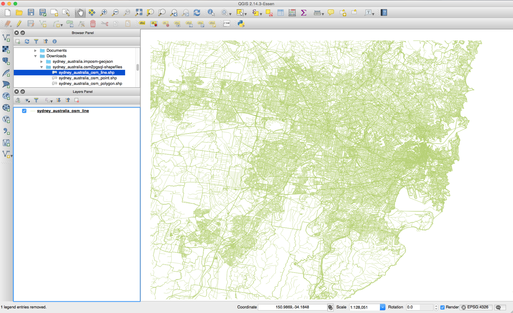
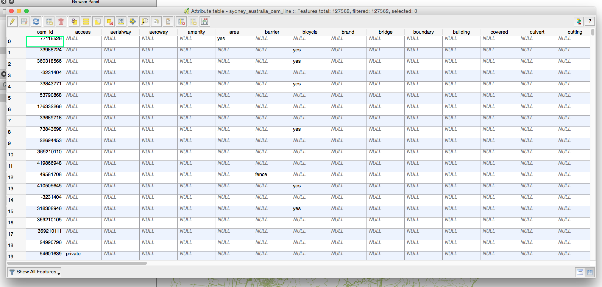
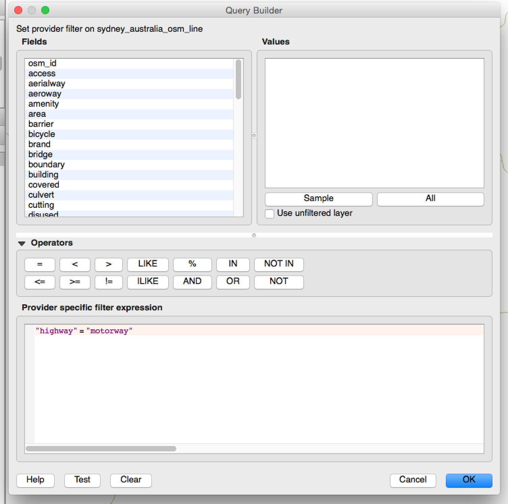
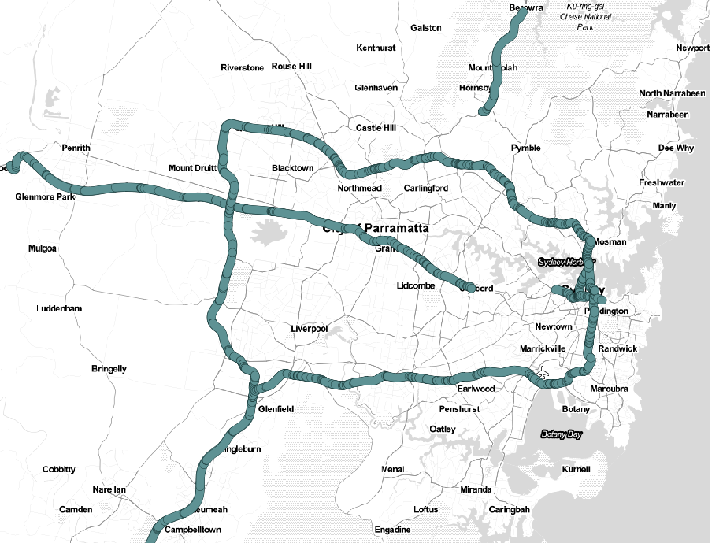
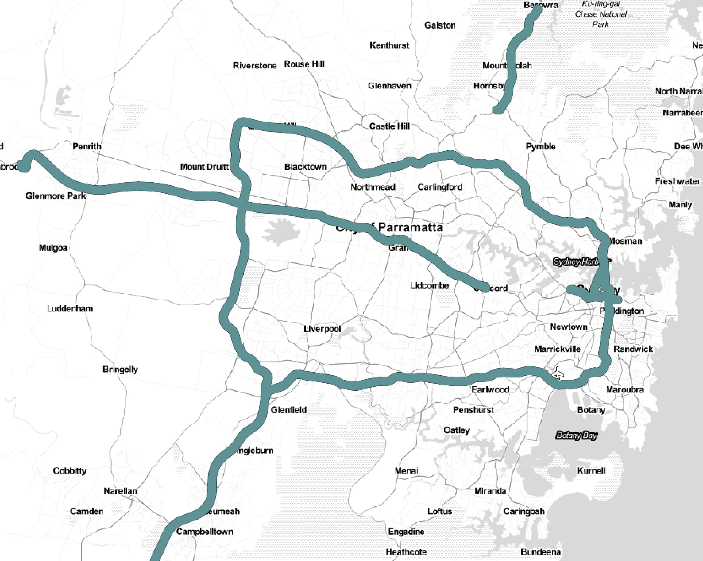

# Use Metro Extracts data in QGIS

Metro Extracts are chunks of OpenStreetMap data clipped to the rectangular region surrounding a particular city or region of interest. There are extracts available for immediate download of the top 200 most popular regions and you can also create [custom extracts](custom-extracts.md) that are available within 30-60 minutes.

This tutorial will cover how to download an extract of OSM data for a region and load the file into [QGIS](http://www.qgis.org/en/site/), which is a free, open-source desktop GIS application. Covered in this tutorial is how to download data from Metro Extracts, which file format to pick, how to open the data in QGIS, and how to make a map of Sydney, Australia. You can follow along by downloading the data for Sydney, or choose a different city.

For this tutorial, we are going to look at two types of file formats suitable for a typical mapping workflow in QGIS. These two types are processed to different levels of granularity that can be useful for different reasons. One file type separates the OSM data by geometry type, this is the [osm2pgsql](http://wiki.openstreetmap.org/wiki/Osm2pgsql) extract. The other, the [imposm](https://imposm.org/) extract, is a bit more processed and separates the OSM data by the different tags, separating the data into logical layers like roads, administrative boundaries, buildings, and so on.

### Requirements

1. An Internet connection with the ability to download the Metro Extract files. The Sydney data used in this exercise is approximately 23 MB, but downloads for other cities range from 2 MB to 350 MB.
2. QGIS and its dependencies, such as GDAL. QGIS is available for multiple platforms, including Windows and Mac. If you need to install QGIS, follow the instructions for your [operating system](https://www.qgis.org/en/site/forusers/download.html). The tutorial is written using QGIS 2.14 (Essen).

## Download the extract files

1. Open a web browser to the Metro Extracts download page at https://mapzen.com/data/metro-extracts/. The page has a map showing the available downloads, as well as a filter box and an alphabetical list of city names below it.

    

2. The left part of the page has a list of the top 200 popular metro extract areas that are available for immediate download. For this tutorial, we'll be choosing Sydney, Australia which is on the list. [Custom extracts](custom-extracts.md) can also be created.
3. To select Sydney, you can scroll down the list until you see the extract's name (note that they are organized by country), use the search bar, or zoom into the map on the right side of the page. Once you've navigated to the extract, click on 'Sydney' to choose a file format.
4. Once you've selected a metro extract, you are navigated to a page which allows you to look at the extract on a map, and select a file format to download. There are a multitude of formats available, depending on what you intend to use this data for. Learn more about [file formats](file-format.md) in Metro Extracts.

    

5. Select one of each of the processed data types (osm2pgsql and imposm) on the extract page. Each of these file formats has two different options: GeoJSON or Shapefile. For the sake of this tutorial, we'll be using one of each option to look at the differences between the different OSM extract types as well as different spatial data file formats.

### Download the file formats

  1. Under the OSM2PGSQL heading, click on the SHAPEFILE button to download the files.
  2. Under the IMPOSM heading, click on the GeoJSON button to download the files.
  3. Find the downloaded files on disk (by default, they will be in your machine's download folder) and unzip them if they were not unzipped automatically. There should be two folders, each containing the appropriate Metro Extracts files.

Note: If you are using Safari as your browser, your downloads may get unzipped automatically and the folders be named slightly differently than those shown in this tutorial.

While a GeoJSON is a single .geojson file on disk, one shapefile is made of individual files (.shp, .dbf, .prj, and so on), so do not delete or move individually any of these constituent files to avoid corrupting the shapefile and having to download it again. If you manage the files through GIS software, the components are treated as a whole entity and are updated appropriately.

## Add the OSM2PGSQL shapefiles to QGIS

Now that the files are downloaded, you will load them into QGIS.

1. Start QGIS and display a blank map.
2. On the Browser panel, navigate to the downloads folder (or wherever your shapefile and GeoJSON downloaded) and open the 'sydney_australia.osm2pgsql-shapefiles' folder. If you downloaded a city other than Sydney, navigate to that folder and expand its contents.
3. Notice that the folder contains three shapefiles, named by the geometry type: point, line, and polygon.
4. Double click on the line layer to open it on the map. Because the extracts are based on a rectangular bounding box, the layer's extent will extend beyond the true administrative boundaries of a city.

    

## Add a basemap to your map

With the lines alone, it is hard to tell much about the area. You can add a basemap to give the lines more reference. One way to add a basemap is by adding a plug-in to QGIS that allows you to choose from a variety of basemap providers and map types. You will use the OpenLayers plug-in; you need to install it if you do not already have it. If you already have it, skip the installation steps.

#### Install the OpenLayers plug-in

1. Click the Plugins menu.
2. Click Manage and Install Plugins.
3. On the All tab, in the Search box, type openlayers.
4. Click OpenLayers Plugin, install it, and close the dialog box.

#### Choose a basemap
1. Click the Web menu, point to OpenLayers Plugin, point to OSM/Stamen, and click Stamen Toner/OSM. This adds a black-and-white basemap of OpenStreetMap data provided by [Stamen](https://www.stamen.com).

    

2. If the basemap obscures your line layer, drag the basemap to the bottom of the layer list.

The shapefiles and GeoJSONs all have a spatial reference of WGS 84, and more specifically, EPSG:4326. When using GIS software, such as QGIS or ArcMap, you should be able to overlay the OSM layers with others in your map (note that in QGIS, you need to enable on-the-fly projection in the project's properties). If you are having problems with data alignment, review the documentation for the software you are using for tips on troubleshooting projections.    

### View the extract's attribute values

The line layer has over 100,000 features in it, representing every line in OSM in this region, although you are only interested in mapping roads for this tutorial. You can view the attribute table to understand the search terms to use to limit the display to only certain features.

In OSM, a feature is identified through a [tag](http://wiki.openstreetmap.org/wiki/Tags) that describes the attributes as a key and a value. The key is a broad category, such as `highway`, and the value provides more details, such as the type of road or its name.

1. Under Layers, right-click the sydney_australia_osm_line layer and click Open Attribute Table.
2. In the table, the columns across the top represent the most common keys. The rows are individual features in the OSM database referenced by their OSM identification number. As you look through the attribute values, notice that most of the them are `NULL`, indicating that the tag has not been populated.

    

3. Scroll the table to the right to see the highways field and scroll down to see the values in that field.

### Query for road features

As you looked through the table, you may have noticed a few features with a value of [motorway](http://wiki.openstreetmap.org/wiki/Tag:highway%3Dmotorway). A motorway is the highest-level of road in a territory. You can query the attribute table to display only the features that are classified as motorways near Lisbon.

1. Right-click the line layer and click Filter. This opens a dialog box where you can enter a query to filter the layer.
2. In the Fields list, double-click `highway` to add it to expression box below. A field is another term for a column in the attribute table.
3. Under Operators, click the `equals` button.
4. Under Values, click All to get a listing of the available values for the highways field.
5. Double-click `motorway` to add it to the expression. Your expression should read: ``"highway" = 'motorway'``.

    

6. Click the Test button to verify the syntax of your query. You should receive a message indicating that over 1,000 rows were returned. If not, make sure your text matches the text in the image.
7. Click OK.

Tip: In some cases, performing a query in QGIS may fail if the shapefile has a period or dot in its name. If this happens, rename the shapefile to remove the period. You should not see this with Metro Extracts because the files use underscores.

The map and attribute table now show fewer features because only motorways are being displayed. The other features that do not satisfy the query are still present in the shapefile, but are being hidden from the map. You can export the features, though, if you do want to make a new layer with only motorway lines. If you want to draw all the features again, you can remove the query.

The simplicity of having all line features being grouped into one line layer is the benefit of the osm2pgsql format, but it does require performing queries to be the most useful.

### Change the symbols for the line features

Because motorways are major roads, they should be displayed with a thicker line. QGIS comes with a series of styles already loaded. You can choose to use one of them or build your own symbol to display motorways.

1. Under Layers, double-click the line layer to open its properties.
2. Click the Style tab.
3. Find the Motorway symbol in the list of styles and click it.
4. Click OK to apply the symbol.

    

Because each line feature is being rendered individually, the symbols overlap. Instead, the lines should be drawn as one, continuous feature. You can use a technique called symbol level drawing to merge symbol boundaries.

5. Open the layer's properties again to the Styles tab.
6. Click the Advanced button, and click Symbol levels.
7. Check Enable symbol levels.
8. Click OK on all dialog boxes.

    

Note that there are other cartographic functions on the Styles tab to improve the appearance of the lines layer, including transparency. You can experiment with these on your own.

## Add the IMPOSM GeoJSON files to QGIS

So far you have used the osm2pgsql shapefile, but you also downloaded one of the imposm GeoJSON files. Next, you will add that file to QGIS.

The imposm extraction process results in a series of individual layers named by different themes, such as buildings and places. You may also see files with -gen appended to the name, indicating that the features have been generalized, or simplified. Because features in the imposm layers are already categorized based on attributes, it is less likely that you will need to run your own query to display the features you want. For example, if you want to work with roads, you can find them already grouped in a roads layer.

1. On the Browser panel, expand the sydney_australia.imposm-geojson folder.
2. Add the sydney_australia_places GeoJSON file to the map.

In the imposm process, the categorization of features into particular layers is determined by the listing and hierarchy in a [JSON file](https://github.com/mapzen/chef-metroextractor/blob/master/files/default/mapping.json). In some cases, this may result in certain OSM tags being in parts of multiple layers. If you cannot find a particular attribute value in the first layer you check, look through the other imposm files, or go back and export it from the osm2pgsql layer.

### Change the symbols for the places layer

The features in the places layer are drawn with one symbol, but you can use the attribute values to draw them in categories with different symbols for certain values.

1. Open the places layer's properties.
2. Click the Style tab.
3. Under Single Symbol, click Categorized to change the drawing method to draw the features by categories.
4. For Column, click `type` to set the `type` field as the field containing the values that will be used to draw the features.
5. Click Classify below the box. This adds all the unique values in the type field and assigns them a separate symbol.
6. If there are any symbols without values or legend entries, highlight them in the list and click Delete.
7. To make the city symbol larger and more prominent, right-click it in the list and click Change size. Set the size to 5.

    

8. You can experiment with the symbol colors and sizes to make the different points appear the way you want.
9. Click OK when you are done to return to the map and see your changes.
10. Optionally, save your project when you are done.

Beyond QGIS on the desktop, there are many web-based tools you can use to display GeoJSON. Some of the websites you can use without scripting include [geojson.io](http://geojson.io/) and the [GitHub website](https://help.github.com/articles/mapping-geojson-files-on-github/). Not all applications support large numbers of features or direct editing of GeoJSON, so you may need to convert to another format. Consult the documentation for the software you are using to learn more about its capabilities and limitations.

## Tutorial summary and new cities for Metro Extracts

In this tutorial, you downloaded different file formats of Metro Extracts, added the layers to QGIS, and performed queries and set symbols for the features. You should have a better idea of the contents of each download so you can decide which one works best for your project. To learn how to create custom extracts, follow this [tutorial](custom-extracts.md).

### Data credits
OpenStreetMap data: &copy; OSM contributors

Toner map: Map tiles by [Stamen Design](http://stamen.com), under [CC BY 3.0](http://creativecommons.org/licenses/by/3.0).
